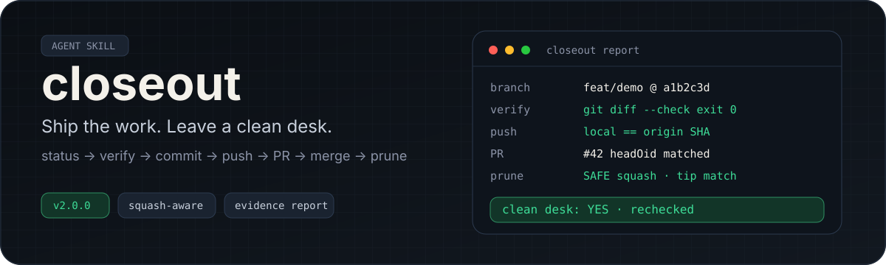
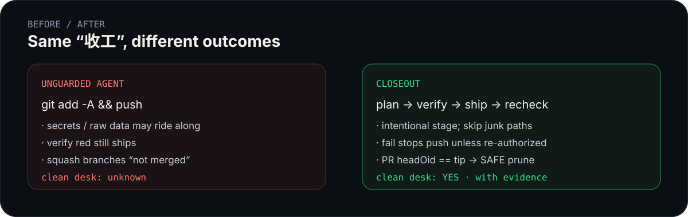
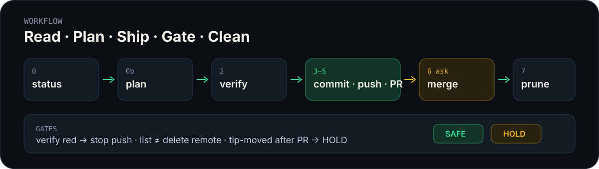

# closeout

[](https://github.com/D-sudoasd/closeout/actions/workflows/ci.yml)
[](LICENSE)
[](https://github.com/PowerShell/PowerShell)
[](https://github.com/D-sudoasd/closeout/releases)

**把活收完，桌子收拾干净。**

面向 AI agent 的 git 收工技能：状态 → 验证 → 提交 → 推送 → PR → 合并门禁 → 清分支。强调 **授权边界**、**squash 可识别**、**可复核证据报告**。

[English](README.md) · [变更记录](CHANGELOG.md) · [安装](INSTALL.md) · [授权矩阵](references/auth-matrix.md) · [推广文案](docs/PROMOTE.md)

<p align="center">
  
</p>

---

## 为什么不能「让 agent 随便推」？

| 裸 agent 常见翻车 | closeout 的做法 |
|-------------------|-----------------|
| 盲 `git add -A` | 有意识暂存；跳过密钥 / 大批原始数据 |
| 验证红了还推 | 默认停推；仅本地或二次明确授权 |
| squash 后清不掉分支 | PR head SHA 与 tip 一致才 SAFE |
| 把 `origin/HEAD` 当分支删 | 结构化枚举，跳过符号引用 |
| 「展示了列表」= 授权删远程 | **展示 ≠ 授权** |
| 命令失败却报告成功 | 检查退出码 + 删除后复查 |
| 升级冲掉个人配置 | 保留 `USER.md` |

<p align="center">
  
</p>

---

## 怎么用

对 Grok / Codex 说：**收工**、**收尾**、**ship** 或 **`/closeout`**。

<p align="center">
  
</p>

| 阶段 | 做什么 | 门禁 |
|-----:|--------|------|
| 0 | 只读状态 | 出报告 |
| 0b | 执行清单 | 确认或按 USER |
| 2 | 验证 + 退出码 | 通过或明确失败策略 |
| 3–5 | 提交 · 推送 · PR | SHA / head 核对 |
| 6 | 合并 | **默认先问** |
| 7 | 清分支 | 先列表再确认；远程单独授权 |

无 agent 也可直接跑脚本：

```powershell
$Skill = Join-Path $env:USERPROFILE ".grok\skills\closeout\scripts"
$Repo  = "D:\path\to\repo"

pwsh -File "$Skill\status.ps1" -RepoRoot $Repo
pwsh -File "$Skill\prune_merged.ps1" -RepoRoot $Repo
```

---

## 安装（约 30 秒）

```powershell
git clone https://github.com/D-sudoasd/closeout.git "$env:USERPROFILE\.grok\skills\closeout"
```

升级：`git -C ...\closeout pull`  
或：`pwsh -File .\install.ps1 -Source .`（保留本机 `USER.md`）

依赖：**git**、**pwsh 7+**、做 PR/squash 识别需要 **`gh`**。  
重启会话后说 **收工** 即可。

---

## 清分支判定（v2）

```text
tip 是默认分支祖先          → SAFE（普通 merge）
已合并 PR 且 headOid == tip → SAFE（squash/rebase）
PR 已合但 tip 已变          → HOLD
无法确认                    → 只报告
当前 / 默认 / HEAD          → 永不删
```

---

## 授权一览

| 你说 | 默认范围 |
|------|----------|
| 收工 / `/closeout` | 状态 + 验证 + 清单；push/PR 看 `USER.md` |
| 提交并推 | 验证 + 提交 + 推送 |
| 合并 | 检查后合并 |
| 清分支 | **只列表** |
| 明确删远程 | 远程清理 |

完整规则见 [references/auth-matrix.md](references/auth-matrix.md)。  
可转发文案见 [docs/PROMOTE.md](docs/PROMOTE.md)。

---

## 许可

[MIT](LICENSE) © 2026 D-sudoasd
